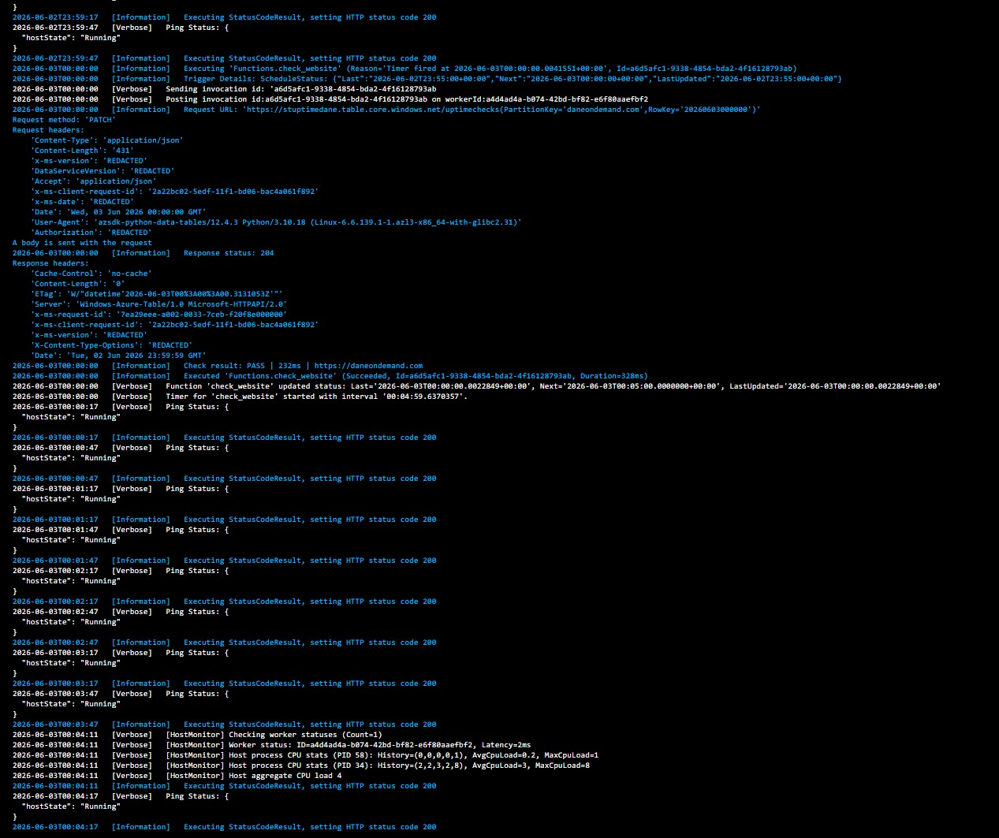
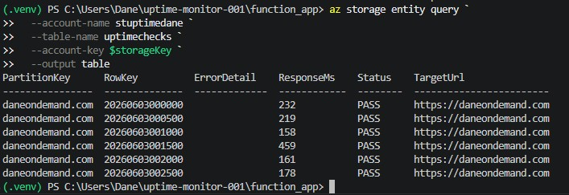

# 🟢 Azure Website Uptime Monitor

> 📹 **Walkthrough Video:** _[Loom video coming soon — link will be added here]_

A production-grade, automated website monitoring system built entirely on Azure. Checks a target website every 5 minutes for availability, response time, and content validity — and fires email + SMS alerts within seconds of any failure. All infrastructure is deployed as code using Terraform.

---

## 📋 Table of Contents

- [What This Builds](#what-this-builds)
- [Architecture](#architecture)
- [Prerequisites](#prerequisites)
- [Project Structure](#project-structure)
- [Deployment Guide](#deployment-guide)
- [Function Code Explained](#function-code-explained)
- [Verification](#verification)
- [Troubleshooting Log](#troubleshooting-log)
- [Key Lessons Learned](#key-lessons-learned)
- [Teardown](#teardown)

---

## What This Builds

Every business with a website lives with a version of this fear: the site goes down, a customer tries to visit, gets an error, and leaves — and the business owner doesn't find out until sales numbers drop the next day.

This project eliminates that blind spot entirely.

| Feature | Detail |
|---|---|
| **Check frequency** | Every 5 minutes, 24/7 |
| **What it checks** | HTTP status code, response time (<5s), page content |
| **Alert speed** | Within seconds of failure |
| **Alert channels** | Email + SMS simultaneously |
| **Data retention** | Every check result logged to Azure Table Storage |
| **Infrastructure** | 100% Terraform — repeatable, version-controlled |

---

## Architecture

```
rg-uptime-monitor-[yourname]
│
├── 📦 Storage Account (stuptime[yourname])
│   └── Table: uptimechecks
│       └── Stores every check result with timestamp,
│           response time, and PASS/SLOW/FAIL status
│
├── 🖥️  App Service Plan (asp-uptime-[yourname])
│   └── Consumption (Y1) — pay only when function runs
│
├── ⚡ Function App (func-uptime-[yourname])
│   └── Function: check_website
│       ├── Trigger: Timer — every 5 minutes (CRON)
│       ├── Checks: HTTP status, response time, content
│       └── Writes: Result entity to Table Storage
│
├── 📊 Log Analytics Workspace (law-uptime-[yourname])
│   └── Central log store for all telemetry
│
├── 🔍 Application Insights (appi-uptime-[yourname])
│   └── Monitors the Function App itself
│       ├── Invocation counts
│       ├── Execution duration
│       └── Exception tracking
│
├── 🔔 Monitor Action Group (ag-uptime-[yourname])
│   ├── Email receiver → business owner
│   └── SMS receiver → business owner phone
│
└── 🚨 Monitor Alert Rule (alert-site-down-[yourname])
    ├── Queries: Log Analytics every 5 minutes (KQL)
    ├── Condition: Any "SITE DOWN" error log present
    └── Action: Triggers Action Group → email + SMS
```

### Data Flow Diagram

```
┌─────────────────────────────────────────────────────────┐
│                    Every 5 Minutes                       │
│                                                         │
│  Timer Trigger                                          │
│      │                                                  │
│      ▼                                                  │
│  check_website()  ──── HTTP GET ────► Target Website    │
│      │                                                  │
│      ├── Status == 200?          → PASS / FAIL          │
│      ├── Response time < 5000ms? → PASS / SLOW          │
│      └── Content looks valid?    → PASS / FAIL          │
│                                                         │
│      │                                                  │
│      ▼                                                  │
│  Write Result ──────────────────► Table Storage         │
│      │                           (uptimechecks)         │
│      │                                                  │
│      ▼ (on failure)                                     │
│  logging.error("SITE DOWN...")                          │
│      │                                                  │
│      ▼                                                  │
│  Application Insights ──────────► Log Analytics         │
│                                        │                │
│                                        ▼                │
│                                   Alert Rule            │
│                                   (KQL Query)           │
│                                        │                │
│                                        ▼                │
│                                   Action Group          │
│                                   ├── 📧 Email          │
│                                   └── 📱 SMS            │
└─────────────────────────────────────────────────────────┘
```

---

## Prerequisites

- [Terraform](https://developer.hashicorp.com/terraform/install) installed
- [Azure CLI](https://learn.microsoft.com/en-us/cli/azure/install-azure-cli) installed and logged in (`az login`)
- Python 3.x installed locally
- An active Azure subscription
- [VS Code](https://code.visualstudio.com/) with the **Azure Functions extension** installed

> ⚠️ **Important:** Your local Python version does not need to match Azure's runtime (3.10). The VS Code extension handles remote builds on Azure's end using Oryx.

---

## Project Structure

```
uptime-monitor-001/
├── function_app/
│   ├── function_app.py       ← Main monitoring logic (V2 model)
│   ├── host.json             ← Functions host configuration
│   └── requirements.txt      ← Python dependencies
├── main.tf                   ← All Azure resources
├── variables.tf              ← Input variable definitions
├── outputs.tf                ← Output values after deploy
└── terraform.tfvars          ← Your actual values (not committed)
```

---

## Deployment Guide

### Step 1 — Clone and Configure

**Mac:**
```bash
mkdir ~/uptime-monitor-001
cd ~/uptime-monitor-001
mkdir function_app
touch main.tf variables.tf outputs.tf terraform.tfvars
touch function_app/function_app.py function_app/requirements.txt function_app/host.json
```

**Windows (PowerShell):**
```powershell
New-Item -ItemType Directory -Path "$HOME\uptime-monitor-001"
cd "$HOME\uptime-monitor-001"
New-Item -ItemType Directory -Path "function_app"
New-Item -ItemType File main.tf, variables.tf, outputs.tf, terraform.tfvars
New-Item -ItemType File function_app\function_app.py, function_app\requirements.txt, function_app\host.json
```

Create `terraform.tfvars`:

```hcl
yourname    = "yourname"
location    = "Central US"
target_url  = "https://yourwebsite.com"
alert_email = "your@email.com"
alert_phone = "+14045550100"
```

> **Note:** If you hit a quota error in East US, deploy to **Central US** instead — simply update the `location` value above.

### Step 2 — Write variables.tf

```hcl
variable "yourname" {
  type = string
}

variable "location" {
  type    = string
  default = "Central US"
}

variable "target_url" {
  description = "The website URL to monitor. Include https://."
  type        = string
}

variable "alert_email" {
  description = "Email address for downtime alerts."
  type        = string
}

variable "alert_phone" {
  description = "Phone number for SMS alerts in E.164 format (e.g. +14045550100)."
  type        = string
}

variable "tags" {
  type = map(string)
  default = {
    project    = "uptime-monitor"
    managed_by = "terraform"
  }
}
```

### Step 3 — Write the Function Code

**`function_app/requirements.txt`**
```
azure-data-tables==12.4.3
requests==2.31.0
```

**`function_app/host.json`**
```json
{
  "version": "2.0",
  "logging": {
    "applicationInsights": {
      "samplingSettings": {
        "isEnabled": true
      }
    }
  },
  "extensionBundle": {
    "id": "Microsoft.Azure.Functions.ExtensionBundle",
    "version": "[4.*, 5.0.0)"
  }
}
```

**`function_app/function_app.py`**
```python
import azure.functions as func
from azure.data.tables import TableServiceClient
import requests
import datetime
import os
import logging

app = func.FunctionApp()

@app.timer_trigger(schedule="0 */5 * * * *",
                   arg_name="mytimer",
                   run_on_startup=False)
def check_website(mytimer: func.TimerRequest) -> None:
    target_url    = os.environ["TARGET_URL"]
    storage_conn  = os.environ["AzureWebJobsStorage"]
    check_time    = datetime.datetime.utcnow()
    result_status = "PASS"
    error_detail  = None
    response_ms   = None

    try:
        response    = requests.get(target_url, timeout=10)
        response_ms = response.elapsed.total_seconds() * 1000

        if response.status_code != 200:
            result_status = "FAIL"
            error_detail  = f"HTTP {response.status_code}"
        elif response_ms > 5000:
            result_status = "SLOW"
            error_detail  = f"Response time {response_ms:.0f}ms exceeded 5000ms"
        elif "error" in response.text.lower() and "404" in response.text:
            result_status = "FAIL"
            error_detail  = "Page contains error indicators"

    except requests.exceptions.ConnectionError:
        result_status = "FAIL"
        error_detail  = "Connection refused"
    except requests.exceptions.Timeout:
        result_status = "FAIL"
        error_detail  = "Request timed out after 10 seconds"
    except Exception as e:
        result_status = "FAIL"
        error_detail  = str(e)

    # Sanitize PartitionKey — Azure Table Storage does not allow
    # forward slashes or colons in partition keys
    partition_key = (
        target_url
        .replace("https://", "")
        .replace("http://", "")
        .replace("/", "_")
    )

    table_service = TableServiceClient.from_connection_string(storage_conn)
    table_client  = table_service.get_table_client("uptimechecks")

    entity = {
        "PartitionKey": partition_key,
        "RowKey":       check_time.strftime("%Y%m%d%H%M%S"),
        "Timestamp":    check_time.isoformat(),
        "Status":       result_status,
        "ResponseMs":   int(response_ms) if response_ms else 0,
        "ErrorDetail":  error_detail or "",
        "TargetUrl":    target_url,
    }

    try:
        table_service.create_table_if_not_exists("uptimechecks")
        table_client.upsert_entity(entity)
        logging.info(f"Check result: {result_status} | {response_ms:.0f}ms | {target_url}")
    except Exception as e:
        logging.error(f"Failed to write to table: {e}")

    if result_status != "PASS":
        logging.error(f"SITE DOWN: {target_url} | {result_status} | {error_detail}")
```

### Step 4 — Write main.tf

> Full `main.tf` includes: provider, resource group, storage account + table, Log Analytics workspace, Application Insights, App Service Plan, Linux Function App, Monitor Action Group, and Monitor Alert Rule. See the full file in this repository.

Key things to get right in `app_settings`:

```hcl
app_settings = {
  "TARGET_URL"                            = var.target_url
  "APPINSIGHTS_INSTRUMENTATIONKEY"        = azurerm_application_insights.main.instrumentation_key
  "APPLICATIONINSIGHTS_CONNECTION_STRING" = azurerm_application_insights.main.connection_string
  "AzureWebJobsStorage"                   = azurerm_storage_account.main.primary_connection_string
  "FUNCTIONS_WORKER_RUNTIME"              = "python"
  "WEBSITE_RUN_FROM_PACKAGE"              = "0"   # Must be "0" — see troubleshooting
}
```

> ⚠️ **`WEBSITE_RUN_FROM_PACKAGE` must be `"0"`** — setting it to `"1"` blocks all zip-based deployments and was the root cause of multiple hours of troubleshooting in this lab.

### Step 5 — Deploy Infrastructure

**Mac & Windows (PowerShell):**
```powershell
terraform init
terraform plan
terraform apply
```

Expect **9 resources**. Deployment takes 3–5 minutes.

### Step 6 — Deploy Function Code via VS Code

> **Do not use `az functionapp deployment source config-zip` on Linux Consumption plans.** Kudu is unreliable on this plan type. Use the VS Code Azure Functions extension instead.

1. Open VS Code in the `uptime-monitor-001` folder
2. Install the **Azure Functions** extension if not already installed
3. In the Azure panel (left sidebar), sign in to your subscription
4. Expand **Function App** → find `func-uptime-[yourname]`
5. Right-click → **Deploy to Function App...**
6. Select the `function_app` folder
7. Click **Deploy** on the confirmation dialog

The extension uses Oryx remote build, which installs packages on Azure's Python 3.10 runtime — eliminating local version mismatch issues entirely.

**Successful deployment output looks like:**
```
✅ Zip and deploy workspace — Succeeded in 2s
✅ Build app in Azure — Succeeded in 6s  
✅ Deploy to app — Succeeded in 21s
ℹ️  Deployment to "func-uptime-[yourname]" completed.
```

---

## Function Code Explained

### Why V2 Programming Model?

The lab guide uses the V1 model (`function.json` + separate script file). During deployment it was discovered that the Azure Functions runtime on Linux Consumption expects the **V2 model** (single `function_app.py` with Python decorators). V1 functions were silently ignored — the host started but no functions registered.

**V1 (does not work reliably on Linux Consumption):**
```
function_app/
├── check_website.py    ← logic
└── function.json       ← binding config
```

**V2 (correct approach):**
```
function_app/
└── function_app.py     ← logic + bindings together via decorators
```

### CRON Schedule Explained

```
"0 */5 * * * *"
 │  │   │ │ │ └─ day of week (any)
 │  │   │ │ └─── month (any)
 │  │   │ └───── day of month (any)
 │  │   └─────── hours (any)
 │  └─────────── minutes (every 5)
 └────────────── seconds (0)
```

### PartitionKey Sanitization

Azure Table Storage rejects partition keys containing `/` or `:`. Since `TARGET_URL` contains `https://`, the raw URL cannot be used directly.

```python
# This FAILS with HTTP 400
"PartitionKey": "https://daneondemand.com"

# This WORKS
"PartitionKey": "daneondemand.com"
```

---

## Verification

### Check 1 — Log Stream (Portal)
```
Portal → func-uptime-[yourname] → Log stream
```

Within 5 minutes you should see:
```
[Information] Executing 'Functions.check_website' (Reason='Timer fired')
[Information] Check result: PASS | 232ms | https://yoursite.com
[Information] Executed 'Functions.check_website' (Succeeded, Duration=328ms)
```



### Check 2 — Query Table Storage

**Mac/Linux:**
```bash
STORAGE_KEY=$(az storage account keys list \
  --account-name stuptime[yourname] \
  --resource-group rg-uptime-monitor-[yourname] \
  --query "[0].value" --output tsv)

az storage entity query \
  --account-name stuptime[yourname] \
  --table-name uptimechecks \
  --account-key $STORAGE_KEY \
  --output table
```

**Windows (PowerShell):**
```powershell
$storageKey = $(az storage account keys list `
  --account-name stuptime[yourname] `
  --resource-group rg-uptime-monitor-[yourname] `
  --query "[0].value" --output tsv)

az storage entity query `
  --account-name stuptime[yourname] `
  --table-name uptimechecks `
  --account-key $storageKey `
  --output table
```

**Expected output:**
```
PartitionKey       RowKey           ResponseMs   Status   TargetUrl
----------------   --------------   ----------   ------   -----------------------
daneondemand.com   20260603000000   232          PASS     https://daneondemand.com
daneondemand.com   20260603000500   198          PASS     https://daneondemand.com
daneondemand.com   20260603001000   241          PASS     https://daneondemand.com
```



### Verification Checklist

- [ ] Function App shows **Running** status in Portal
- [ ] Log stream shows `check_website` executing every 5 minutes
- [ ] Table Storage `uptimechecks` contains rows with check results
- [ ] Application Insights → Live Metrics shows function invocations
- [ ] Alert rule exists in Monitor → Alerts
- [ ] Action Group has both email and SMS receivers configured

---

## Troubleshooting Log

This section documents every real issue encountered during this lab deployment. These are not hypothetical — each one was hit and resolved in sequence.

---

### Issue 1 — `Operation returned an invalid status 'Bad Request'` on zip deploy

**Command that failed:**
```powershell
az functionapp deployment source config-zip --src function_deploy.zip
```

**Root cause:** `WEBSITE_RUN_FROM_PACKAGE` was set to `"1"` in Terraform. This setting tells Azure to mount the zip as a read-only filesystem, which conflicts with the extraction-based zip deploy method.

**Fix:**
```powershell
az functionapp config appsettings set `
  --name func-uptime-[yourname] `
  --resource-group rg-uptime-monitor-[yourname] `
  --settings "WEBSITE_RUN_FROM_PACKAGE="
```

**Permanent fix:** Change in `main.tf`:
```hcl
"WEBSITE_RUN_FROM_PACKAGE" = "0"
```

---

### Issue 2 — Kudu endpoints returning 404 on Linux Consumption

**Symptoms:**
```
GET https://func-uptime-[yourname].scm.azurewebsites.net/api/functions → 404
GET https://func-uptime-[yourname].scm.azurewebsites.net/api/processes → 404
```

**Root cause:** Kudu (the SCM engine) is unreliable on Linux Consumption plans. The SCM site runs separately from the function app and frequently fails to initialize correctly on this plan type.

**Fix:** Abandon CLI-based zip deploy entirely. Use the **VS Code Azure Functions extension** with Oryx remote build instead. This bypasses Kudu completely.

---

### Issue 3 — All `app_settings` showing `"value": null`

**Symptom:** Running `az functionapp config appsettings list` showed every setting with `null` value, including `TARGET_URL`, `AzureWebJobsStorage`, and `FUNCTIONS_WORKER_RUNTIME`.

**Root cause:** Terraform state had drifted. Manual CLI changes made during troubleshooting were overwritten, and at some point the apply had not fully completed or had failed silently.

**Fix:**

**Mac & Windows (PowerShell):**
```powershell
terraform apply
```

Terraform detected the drift and reapplied all settings. Always run `terraform apply` to restore state rather than manually patching settings one by one — Terraform will always win.

---

### Issue 4 — Function host running but `check_website` never registered

**Symptom:** Log stream showed `hostState: Running` and ping responses every 30 seconds, but `Executing 'Functions.check_website'` never appeared. Table Storage remained empty.

**Root cause:** V1 vs V2 programming model mismatch. The original lab code used the V1 model (`function.json` + `check_website.py`). The Azure Functions runtime on Linux expects the V2 model (single `function_app.py` with `@app.timer_trigger` decorator). V1 functions were silently ignored.

**Fix:** Rewrite the function using the V2 programming model:
```python
app = func.FunctionApp()

@app.timer_trigger(schedule="0 */5 * * * *", arg_name="mytimer", run_on_startup=False)
def check_website(mytimer: func.TimerRequest) -> None:
    # logic here
```

---

### Issue 5 — Table Storage write failing with HTTP 400

**Error in logs:**
```
Request URL: uptimechecks(PartitionKey='https%3A%2F%2Fdaneondemand.com', RowKey='...')
Response status: 400
```

**Root cause:** Azure Table Storage partition keys cannot contain `/` or `:`. The `TARGET_URL` value (`https://daneondemand.com`) was being used directly as the `PartitionKey`.

**Fix:** Sanitize the partition key before writing:
```python
partition_key = (
    target_url
    .replace("https://", "")
    .replace("http://", "")
    .replace("/", "_")
)
```

---

### Issue 6 — `ModuleNotFoundError: azure.data.tables` (if using local pip install)

**Root cause:** Local Python version (3.13/3.14) compiled packages that are incompatible with Azure's Python 3.10 runtime.

**Fix:** Use VS Code extension with Oryx remote build. Azure installs packages on the correct runtime version server-side, eliminating all local version conflicts.

---

### Quick Reference — Troubleshooting Decision Tree

```
Function not executing?
│
├── Check log stream → hostState: Running?
│   ├── NO  → App settings null? → Run terraform apply
│   └── YES → check_website appearing?
│       ├── NO  → V1/V2 model mismatch → rewrite to V2
│       └── YES → Table empty?
│           ├── YES → Check for HTTP 400 → sanitize PartitionKey
│           └── NO  → ✅ Working correctly
│
Zip deploy failing?
│
├── "Bad Request" → Check WEBSITE_RUN_FROM_PACKAGE → set to "0"
├── "401 Unauthorized" → $base64 variable expired → rebuild auth header
├── "404 Not Found" on SCM → Kudu broken → use VS Code extension
└── "Service Unavailable" → app_settings null → run terraform apply
```

---

## Key Lessons Learned

**1. `WEBSITE_RUN_FROM_PACKAGE` is a footgun on Linux Consumption**
Setting this to `"1"` blocks all zip-based deployments. Always set it to `"0"` when using the VS Code extension or Kudu zip deploy.

**2. Kudu is unreliable on Linux Consumption plans**
The SCM endpoint (`*.scm.azurewebsites.net`) frequently fails on Linux Consumption. The VS Code Azure Functions extension with Oryx remote build is the recommended deployment method for this plan type.

**3. Azure Functions V1 vs V2 is a silent failure**
If you deploy V1 model code to a runtime expecting V2, the host starts but registers zero functions — no error, no warning. Always use the V2 programming model (`function_app.py` with decorators) for new Python functions.

**4. Terraform always wins**
Never make manual `az cli` changes to settings that Terraform manages. Terraform will overwrite them on the next apply. Make all permanent changes in `.tf` files.

**5. Azure Table Storage partition key restrictions**
PartitionKey and RowKey cannot contain `/`, `\`, `#`, or `?`. URLs must be sanitized before use as keys.

**6. Remote build > local package bundling**
Bundling packages locally with `pip install --target` introduces Python version mismatch risk. Using `SCM_DO_BUILD_DURING_DEPLOYMENT=true` or the VS Code extension (which sets this automatically) lets Azure install packages on the correct runtime version.

---

## Teardown

When you're done with the lab, destroy all resources to avoid Azure charges:

**Mac & Windows (PowerShell):**
```powershell
terraform destroy
```

Type `yes` when prompted. This removes all 9 resources created by Terraform.

---

## Technologies Used

| Technology | Purpose |
|---|---|
| **Azure Functions** | Timer-triggered serverless compute |
| **Azure Table Storage** | NoSQL storage for check results |
| **Azure Monitor + Action Groups** | Alerting pipeline |
| **Azure Application Insights** | Function App telemetry |
| **Azure Log Analytics** | Central log store + KQL queries |
| **Terraform** | Infrastructure as Code |
| **Python 3.10** | Function runtime |
| **Oryx (Azure remote build)** | Dependency installation on correct runtime |

---

*Built as part of a cloud engineering portfolio project. Infrastructure deployed to Azure Central US.*
